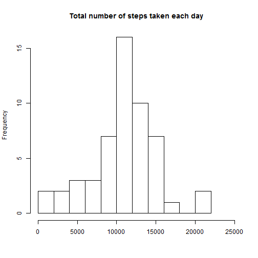
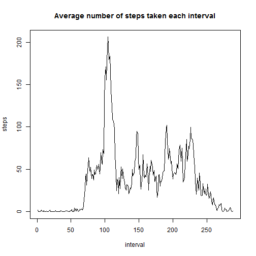
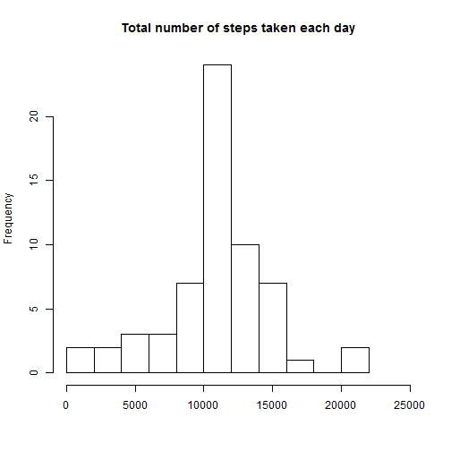
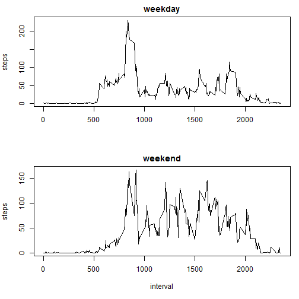

## Loading and preprocessing the data

At this part I load in the database, check variables and change the format of the date variable for further analysis.


```r
activ <- read.csv(unz("activity.zip", "activity.csv"))
head(activ)
table(activ$steps)
table(activ$date)
table(activ$interval)
activ$date<-as.Date(activ$date, "%Y-%m-%d")
```


## What is mean total number of steps taken per day?

For this part, first I clean the database from missing values, then I change it's format to be able to make a histogram which answers the question. Finally I make the plot and take a look at the mean and median of steps.


```r
activ_nomiss<-na.omit(activ)
head(activ_nomiss)
x1<-tapply(activ_nomiss$steps,activ_nomiss$date,sum)
```

```r
hist(x1, main="Total number of steps taken each day", xlab="", xlim=c(0, 25000), breaks=10)
```

 

```r
mean(x1)
```

```
## [1] 10766.19
```

```r
median(x1)
```

```
## [1] 10765
```


## What is the average daily activity pattern?

From the previous cleaned dataset I make another reformatted version for answering this question, then I make a plot.


```r
x2<-tapply(activ_nomiss$steps,activ_nomiss$interval, mean)
head(x2)
```

```r
plot(x2, main="Average number of steps taken each interval", xlab="interval", ylab="steps", type="l")
```

 

Finally I look for the interval and date which contains the maximum number of steps on averege across all days.


```r
max(activ_nomiss$steps)
```

```
## [1] 806
```

```r
activ_nomiss$interval[activ_nomiss$steps==max(activ_nomiss$steps)]
```

```
## [1] 615
```

```r
activ_nomiss$date[activ_nomiss$steps==max(activ_nomiss$steps)]
```

```
## [1] "2012-11-27"
```


## Imputing missing values

In this part I clean the original dataset from missing values by inputing new ones from interval means. See the code below.


```r
table(is.na(activ$steps))
activ$mean<- by(activ$steps, activ$interval, FUN=mean, na.rm=TRUE)
activ$steps[is.na(activ$steps)==TRUE]<-activ$mean[is.na(activ$steps)==TRUE]
activ<-activ[, 1:3]
```

Then I remake the histogram from the first part with the new dataset, and take a look at new mean and median.


```r
x3<-tapply(activ$steps,activ$date,sum)
hist(x3, main="Total number of steps taken each day", xlab="", xlim=c(0, 25000), breaks=10)
```

 

```r
mean(x3)
```

```
## [1] 10766.19
```

```r
median(x3)
```

```
## [1] 10766.19
```

We can see that the results not differ too much compared to the uncleaned version of the data.


## Are there differences in activity patterns between weekdays and weekends?

At this part I replace the date variable with "weekday" and "weekend" categories, then reformat the database and make a plot which shows the difference for taken steps by the two category.


```r
Sys.setlocale("LC_TIME", "English")
activ$date<-as.Date(activ$date, "%Y-%m-%d")
activ$day<-weekdays(activ$date)
activ$day[activ$day=="Friday"]<-"weekday"
activ$day[activ$day=="Monday"]<-"weekday"
activ$day[activ$day=="Saturday"]<-"weekend"
activ$day[activ$day=="Sunday"]<-"weekend"
activ$day[activ$day=="Thursday"]<-"weekday"
activ$day[activ$day=="Tuesday"]<-"weekday"
activ$day[activ$day=="Wednesday"]<-"weekday"
```

```r
table(activ$day)
```

```
## 
## weekday weekend 
##   12960    4608
```

```r
x4<-aggregate(activ$steps, by=list(activ$interval, activ$day), FUN=mean)

par(mfrow=c(2, 1), mar=c(5, 4, 2, 1))
with(subset(x4, Group.2=="weekday"), plot(Group.1, x, type="l", main="weekday", xlab="", ylab="steps"))
with(subset(x4, Group.2=="weekend"), plot(Group.1, x, type="l", main="weekend", xlab="interval", ylab="steps"))
```

 


